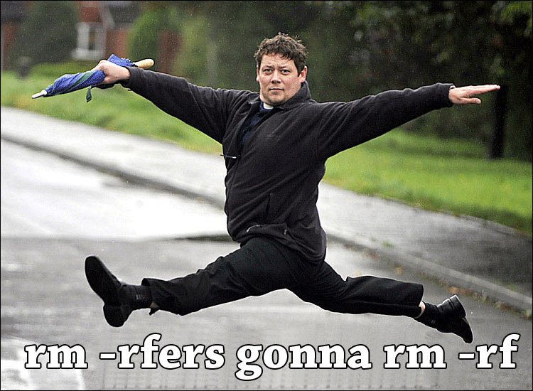

# rm

This command is used to remove files or directories. By default, it does not remove directories but can be manipulated to do so with an option.

To use:

    rm [option] [file path]
    
For example, if you are in `documents/hello` which contains the files `test1.txt` and `test2.txt`, you can remove the files like this:

    rm test1.txt test2.txt

To delete the whole directory `hello` and the files it contains, change to parent directory and use `-r` option:

    cd ..
    rm -r hello
    
## -i
This option makes the shell prompt you before each removal

## -r
This option recursively deletes files and directories

#### PLEASE DO NOT USE `rm -rf` IF YOU DON'T KNOW WHAT YOU ARE DOING, IT WILL RECURSIVELY FORCE REMOVE FILES

